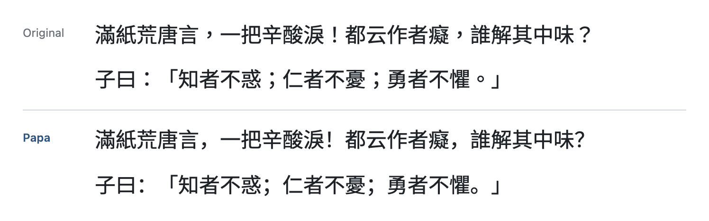
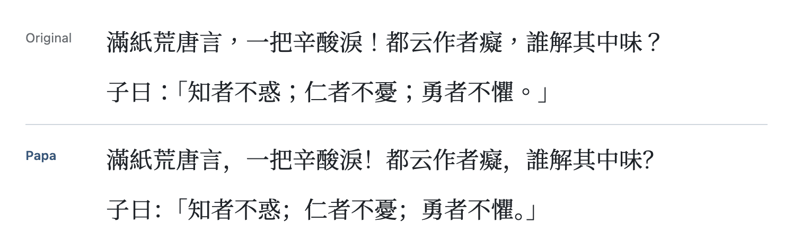
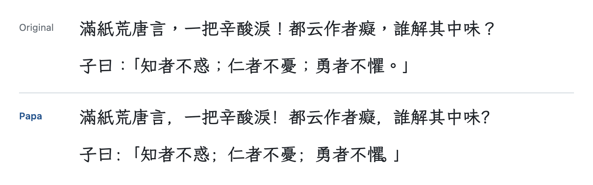
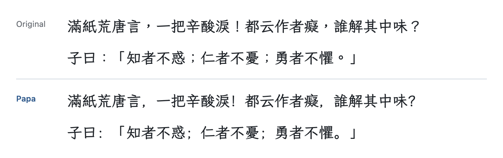

# Papa Fonts

> [!NOTE]
> 我愛看正體中文，但我不愛教育部規範的標點符號位置。

把開源 CJK 字型的繁中 (TC) 版本, 全形標點 `、。，．：；！？` 從字格正中移到左側, 改成簡中 (SC) 的擺法.

本 repo **不包含任何字型檔**. `build.py` 會從上游官方 release 下載, 修改後的字型只輸出到本機的 `out/`.

<details>
<summary><b>預覽</b>: 原版 TC vs Papa</summary>

#### Papa Sarasa Term TC / Term Slab TC



#### Papa Han Serif TC



#### Papa WenKai TC / WenKai Mono TC



#### Papa Iansui



Term Slab 與 WenKai Mono 只有拉丁字母不同, 所以共用同一張預覽.

</details>

## 為什麼用簡中標點

| 規範 | `、。，．` | `：；！？` |
|---|---|---|
| 台灣 (教育部標準, 所有 TC 字型) | 正中 | 正中 |
| 日文 | 左下角 | 正中 |
| 簡中 (GB) | 左下角 | 左半邊 |

> [!TIP]
> 如果你偏好日文的標點符號位置，只要請 agent 微調一下 script 就可以！

## 字型

| Recipe | 輸出 family | 繁中原版 | 標點來源 | 做法 |
|---|---|---|---|---|
| `sarasa` | Papa Sarasa Term TC, Papa Sarasa Term Slab TC | [更紗黑體 Sarasa Gothic](https://github.com/be5invis/Sarasa-Gothic) Term / Term Slab TC | 更紗黑體 SC, 同 style 同字重 | 複製外框 |
| `source-han-serif` | Papa Han Serif TC | [思源宋體 Source Han Serif](https://github.com/adobe-fonts/source-han-serif) TC | 同一個字型檔裡 `locl` 的 SC glyph | cmap 重新指向 |
| `wenkai` | Papa WenKai TC, Papa WenKai Mono TC | [霞鶩文楷 TC](https://github.com/lxgw/LxgwWenkaiTC) | [霞鶩文楷](https://github.com/lxgw/LxgwWenKai) 主版, 同變體同字重 | 複製外框 |
| `iansui` | Papa Iansui | [芫荽 Iansui](https://github.com/ButTaiwan/iansui) | 霞鶩文楷 Regular. 兩者都衍生自 Klee One, 風格一致 | 複製外框 |

上游版本鎖定在各個 `recipes/*.py`.

## 授權

所有上游字型都採用 [SIL Open Font License 1.1](https://openfontlicense.org), 輸出的字型是同授權下的修改版本 (Modified Version).

| 上游 | 保留字型名稱 (Reserved Font Name) | 輸出如何遵守 |
|---|---|---|
| 更紗黑體 | `Source` (承襲自 Adobe) | 保留 `Sarasa`, 名稱不使用 `Source` |
| 思源宋體 | `Source` | 改名為 `Papa Han Serif`, CFF 內部名稱也一併修改 |
| 霞鶩文楷 | `LXGW`, `霞鶩`, `霞鹜`, `落霞孤鶩`, `落霞孤鹜` | 改名為 `Papa WenKai`. 文楷 TC 與芫荽的輸出都含有文楷主版的 glyph |
| 霞鶩文楷 TC | 無 | (同上) |
| 芫荽 | 無 | 加上 `Papa` prefix |

中文等在地化的字型名稱一律移除, 不另外翻譯, 因為其中有些就是保留名稱.

每個 `out/<recipe>/` 都會附上該 recipe 用到的所有上游授權檔. 如果要分享 build 出來的字型, OFL 1.1 要求:

- 跟字型一起附上這些授權檔
- 維持 OFL 1.1 授權
- 不可單獨販售
- 不可使用任何保留字型名稱

本專案與上游作者沒有任何關聯, 也未經其背書.

> [!IMPORTANT]
> 自用就好，勿上傳分享

## Build

需要 [uv](https://docs.astral.sh/uv/).

```sh
uv run --script build.py                 # 全部 recipe
uv run --script build.py sarasa wenkai   # 指定 recipe
```

- 下載檔快取在 `downloads/`, 可能佔用數 GB.
- 每個字型會印出 `，` 修改前後的 bounding box. x 範圍應該從中央 (1000 中約 400..600) 移到左側.
- 只有被替換的 glyph 會移除 hinting, macOS 本來就不使用 hinting.

## 安裝

請先移除舊版的 Papa 字型, 大型 CJK 字型容易被 font cache 卡住.

- macOS: 用 Font Book 開啟, 或複製到 `~/Library/Fonts/`
- Linux: 複製到 `~/.local/share/fonts/` 後執行 `fc-cache -f`
- Windows: 在檔案上按右鍵, 選「為所有使用者安裝」

安裝後請重新開啟使用該字型的 app.

